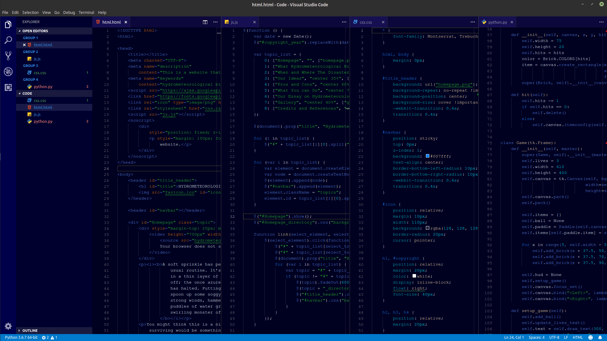
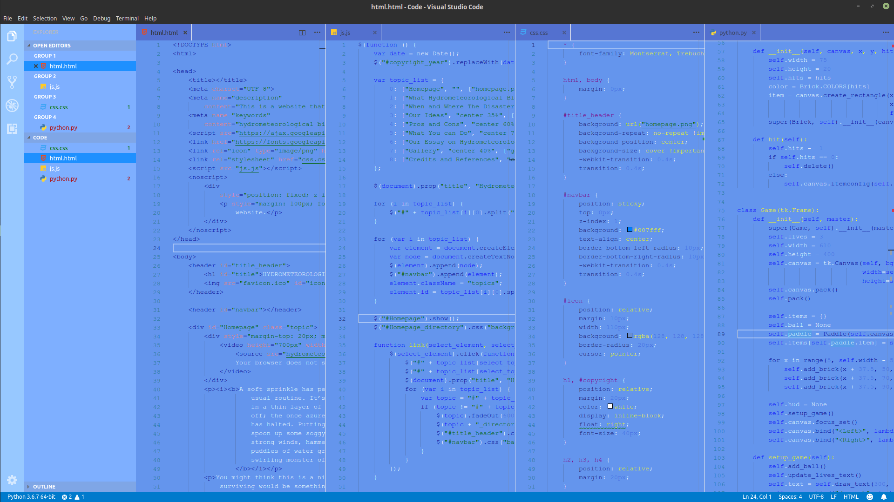

# Crystal Sapphires

Crystal Sapphires is a VS Code theme that I created for myself, made with the help of [Yeoman's VS Code Extension Generator](https://www.npmjs.com/package/generator-code). Install it it you want but this was designed for my own taste since I couldn't fine the right theme for me (by that I mean I looked through the most popular ones and then gave up).

Also, programming is a hobby for me, not a profession so I don't really know that much. I really only tested this out for Python, HTML, CSS, and JS; like I said, made for me.

## Dark Sapphire (Dark)

## Crystal Clear Sapphire (Light)

## Conclusion

Get it if you want. If you do want it, make sure to reconsider the dark theme cos' there's a bug with the info popups in the light theme. The text along with popup are both white so it's almost impossible to read the actual text. Actually, you might as well resconsider on getting this theme at all. **_Remember_**, made for me, the person who knows almost nothing about programming.